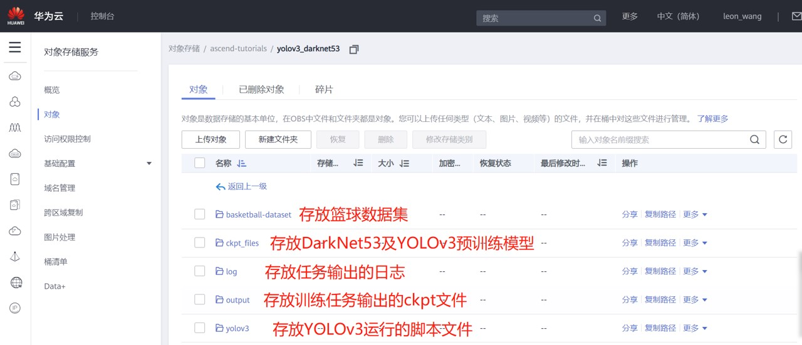
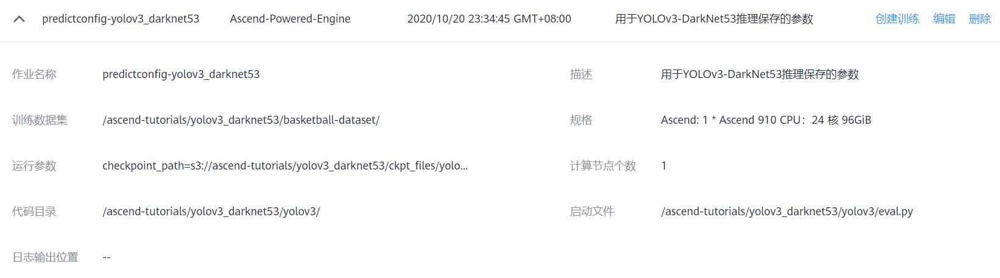
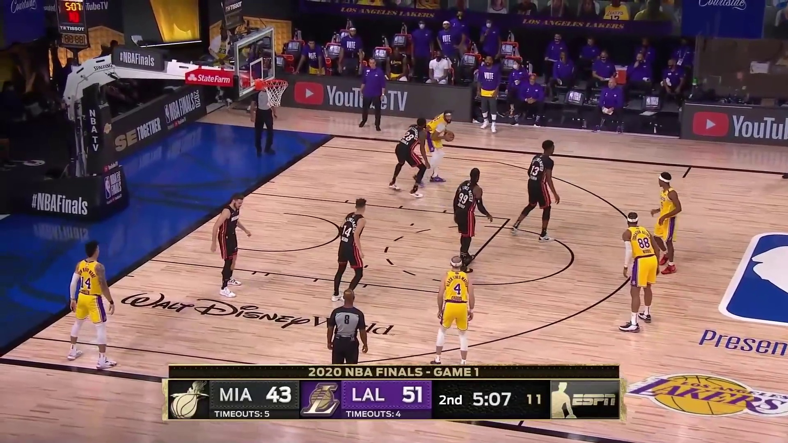

# MindSpore YOLOv3-DarkNet53 Tutorial with ModelArts Ascend Service

This is a tutorial for training MindSpore YOLOv3-DarkNet53 model to detecting basketball game.

> **NOTICE:** The codebase of this tutorial is developed based on `v0.5` MindSpore [ModelZoo](https://gitee.com/mindspore/mindspore/tree/r0.5/model_zoo/yolov3_darknet53).

> **NOTICE:** Considering the pre-trained work would cost so long, so in this tutorial we will not provide provide the full dataset for training, instead we will provide the test dataset and pre-trained YOLOv3 model to simplify the evaluation and prediction job.

## Guidelines

### Download source code

```
git clone https://github.com/leonwanghui/ms-yolov3-basketball.git
cd ms-yolov3-basketball/
```

### Download basketball test dataset

```
cd basketball-dataset/ && wget https://ascend-tutorials.obs.cn-north-4.myhuaweicloud.com/yolov3-darknet53/basketball-dataset/basketball-dataset.zip
unzip basketball-dataset.zip && rm basketball-dataset.zip
cd ../yolov3_ascend/
```

Or you can directly open [https://ascend-tutorials.obs.cn-north-4.myhuaweicloud.com/yolov3_darknet53/basketball-dataset/basketball-dataset.zip](https://ascend-tutorials.obs.cn-north-4.myhuaweicloud.com/yolov3_darknet53/basketball-dataset/basketball-dataset.zip) to download the test dataset from the browser.

### Download the pre-trained YOLOv3-DarkNet53 model

```
cd ./ckpt_files/ && wget https://ascend-tutorials.obs.cn-north-4.myhuaweicloud.com/yolov3_darknet53/ckpt_files/yolov3-320_168000.ckpt
```

Or you can directly open [https://ascend-tutorials.obs.cn-north-4.myhuaweicloud.com/yolov3_darknet53/ckpt_files/yolov3-320_168000.ckpt](https://ascend-tutorials.obs.cn-north-4.myhuaweicloud.com/yolov3_darknet53/ckpt_files/yolov3-320_168000.ckpt) to download the pre-trained model from the browser.

### Upload the dataset and source code to OBS service

Please upload the basketball dataset, pre-trained models and source code to [OBS public cloud service](https://www.huaweicloud.com/product/obs.html) with the format requirement below:



### Model evaluation

Firstly, users need to configure the parameters of evaluation workload like below:


Then follow the video below to activate the evaluation workload:

[Watch the video](https://ascend-tutorials.obs.cn-north-4.myhuaweicloud.com/yolov3_darknet53/demo/yolov3_eval_demo.mp4)

### Model prediction

Firstly, users need to configure the parameters of prediction workload like below:



Then follow the video below to activate the prediction workload:

[Watch the video](https://ascend-tutorials.obs.cn-north-4.myhuaweicloud.com/yolov3_darknet53/demo/yolov3_predict_demo.mp4)

Input image:



Output result:


## License

[Apache License 2.0](../LICENSE)
