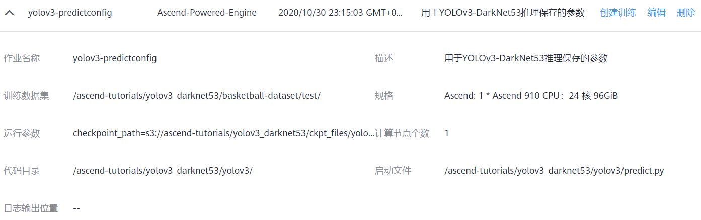

# MindSpore YOLOv3-DarkNet53 Tutorial with ModelArts Ascend Service

This is a tutorial for training MindSpore YOLOv3-DarkNet53 model to detecting basketball game.

> **NOTICE:** The codebase of this tutorial is developed based on `v0.5` MindSpore [ModelZoo](https://gitee.com/mindspore/mindspore/tree/r0.5/model_zoo/yolov3_darknet53).

## Guidelines

### Download source code

```
git clone https://github.com/leonwanghui/ms-yolov3-basketball.git
cd ms-yolov3-basketball/
```

### Download basketball dataset

```
cd basketball-dataset/ && wget https://ascend-tutorials.obs.cn-north-4.myhuaweicloud.com/yolov3-darknet53/basketball-dataset/basketball-dataset.zip
unzip basketball-dataset.zip && rm basketball-dataset.zip
cd ../yolov3_ascend/
```

### Download the pre-trained DarkNet-53 backbone and YOLOv3 model

```
cd ./ckpt_files/
wget https://ascend-tutorials.obs.cn-north-4.myhuaweicloud.com/yolov3_darknet53/ckpt_files/backbone_darknet53.ckpt
wget https://ascend-tutorials.obs.cn-north-4.myhuaweicloud.com/yolov3_darknet53/ckpt_files/yolov3-320_1600.ckpt
```

### Upload the dataset and source code to OBS service

Please upload the basketball dataset, pre-trained models and source code to [OBS public cloud service](https://www.huaweicloud.com/product/obs.html) with the format requirement below:


### Model training

Firstly, users need to configure the parameters of training workload like below:


Then follow the video below to activate the training workload:

[Watch the video](https://ascend-tutorials.obs.cn-north-4.myhuaweicloud.com/yolov3_darknet53/demo/yolov3_train_demo.mp4)

### Model prediction

Firstly, users need to configure the parameters of prediction workload like below:



Then follow the video below to activate the prediction workload:

[Watch the video](https://ascend-tutorials.obs.cn-north-4.myhuaweicloud.com/yolov3_darknet53/demo/yolov3_predict_demo.mp4)

## License

[Apache License 2.0](../LICENSE)
