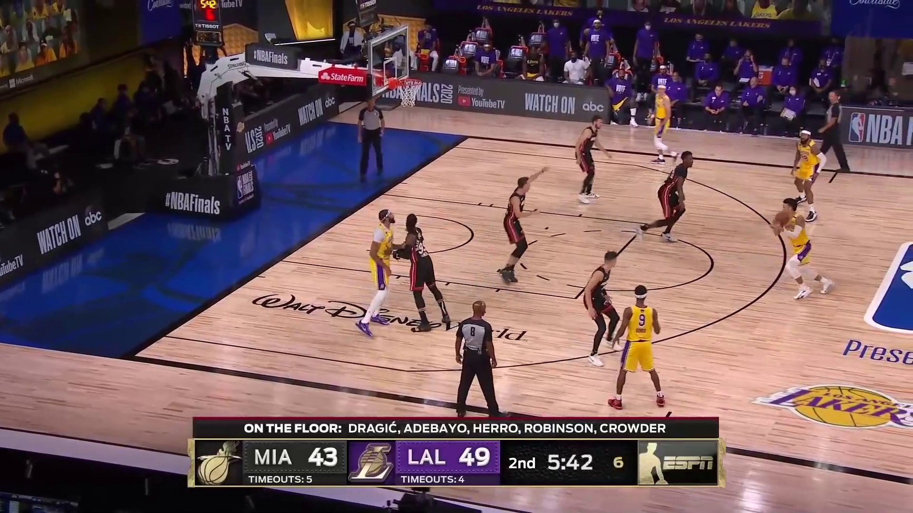

# MindSpore YOLOv3-DarkNet53 Tutorial with GPU backend

This is a tutorial for training MindSpore YOLOv3-DarkNet53 model to detecting basketball game.

> **NOTICE:** The codebase of this tutorial is developed based on `v1.0` MindSpore [ModelZoo](https://github.com/mindspore-ai/mindspore/tree/r1.0/model_zoo/official/cv/yolov3_darknet53).

## Guidelines

### Install some system packages

* System package

    ```
    sudo apt install -y unzip
    ```

* Python package

    ```
    pip install opencv-python pycocotools
    ```

* MindSpore (**v1.0**)

    For MindSpore installation, please refer to [MindSpore install page](https://www.mindspore.cn/install).

### Download source code

```
git clone https://github.com/leonwanghui/ms-yolov3-basketball.git
cd ms-yolov3-basketball/
```

### Download basketball dataset

```
cd basketball-dataset/ && wget https://ascend-tutorials.obs.cn-north-4.myhuaweicloud.com/yolov3-darknet53/basketball-dataset/basketball-dataset.zip
unzip basketball-dataset.zip && rm basketball-dataset.zip
cd ../yolov3_gpu/
```

### Download pre-trained DarkNet-53 backbone model

```
cd ./ckpt_files && wget https://ascend-tutorials.obs.cn-north-4.myhuaweicloud.com/yolov3_darknet53/ckpt_files/backbone_darknet53.ckpt
```

### Model training

```
python train.py --data_dir ../basketball-dataset/ --pretrained_backbone ./ckpt_files/backbone_darknet53.ckpt --lr=0.1 --T_max=320 --max_epoch=320 --warmup_epochs=4 --training_shape=416 --lr_scheduler=cosine_annealing > log.txt 2>&1 &

tail -f log.txt
```
```
......
2020-10-30 20:43:25,064:INFO:epoch[317], iter[123600], loss:29.430322, 45.48 imgs/sec, lr:2.168457467632834e-05
2020-10-30 20:43:33,526:INFO:epoch[317], iter[123700], loss:30.146976, 47.28 imgs/sec, lr:2.168457467632834e-05
2020-10-30 20:43:43,915:INFO:epoch[318], iter[123800], loss:30.651272, 38.50 imgs/sec, lr:9.63797629083274e-06
2020-10-30 20:43:52,695:INFO:epoch[318], iter[123900], loss:29.936550, 45.56 imgs/sec, lr:9.63797629083274e-06
2020-10-30 20:44:01,475:INFO:epoch[318], iter[124000], loss:31.456870, 45.56 imgs/sec, lr:9.63797629083274e-06
2020-10-30 20:44:11,705:INFO:epoch[319], iter[124100], loss:29.058398, 39.11 imgs/sec, lr:2.409552052995423e-06
2020-10-30 20:44:20,540:INFO:epoch[319], iter[124200], loss:30.388533, 45.28 imgs/sec, lr:2.409552052995423e-06
2020-10-30 20:44:29,392:INFO:epoch[319], iter[124300], loss:30.056333, 45.19 imgs/sec, lr:2.409552052995423e-06
2020-10-30 20:44:38,153:INFO:epoch[319], iter[124400], loss:29.689081, 45.66 imgs/sec, lr:2.409552052995423e-06
2020-10-30 20:44:45,746:INFO:==========end training===============
```

### Download the pre-trained YOLOv3 model

```
cd ./ckpt_files && wget https://ascend-tutorials.obs.cn-north-4.myhuaweicloud.com/yolov3_darknet53/ckpt_files/yolov3-320_124480.ckpt
```

### Model evaluation

```
python eval.py --data_dir ../basketball-dataset/ --pretrained ./ckpt_files/yolov3-320_124480.ckpt
```
```
=============coco eval result=========
 Average Precision  (AP) @[ IoU=0.50:0.95 | area=   all | maxDets=100 ] = 0.525
 Average Precision  (AP) @[ IoU=0.50      | area=   all | maxDets=100 ] = 0.805
 Average Precision  (AP) @[ IoU=0.75      | area=   all | maxDets=100 ] = 0.637
 Average Precision  (AP) @[ IoU=0.50:0.95 | area= small | maxDets=100 ] = -1.000
 Average Precision  (AP) @[ IoU=0.50:0.95 | area=medium | maxDets=100 ] = 0.500
 Average Precision  (AP) @[ IoU=0.50:0.95 | area= large | maxDets=100 ] = 0.526
 Average Recall     (AR) @[ IoU=0.50:0.95 | area=   all | maxDets=  1 ] = 0.322
 Average Recall     (AR) @[ IoU=0.50:0.95 | area=   all | maxDets= 10 ] = 0.618
 Average Recall     (AR) @[ IoU=0.50:0.95 | area=   all | maxDets=100 ] = 0.619
 Average Recall     (AR) @[ IoU=0.50:0.95 | area= small | maxDets=100 ] = -1.000
 Average Recall     (AR) @[ IoU=0.50:0.95 | area=medium | maxDets=100 ] = 0.500
 Average Recall     (AR) @[ IoU=0.50:0.95 | area= large | maxDets=100 ] = 0.619
```

### Model prediction

```
python predict.py --image_path ./00068.jpg --pretrained ./ckpt_files/yolov3-320_124480.ckpt
```

Input image:



Output image:


## License

[Apache License 2.0](../LICENSE)
