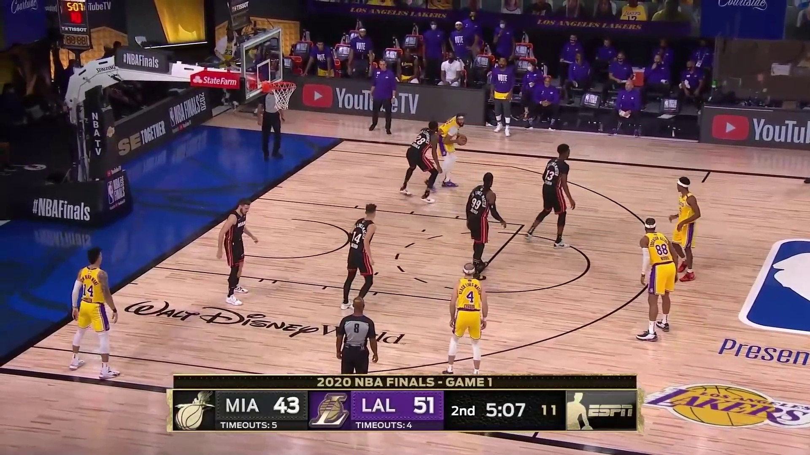

# MindSpore YOLOv3-DarkNet53 Tutorial with GPU backend

This is a tutorial for training MindSpore YOLOv3-DarkNet53 model to detecting basketball game.

> **NOTICE:** The codebase of this tutorial is developed based on `v1.0` MindSpore [ModelZoo](https://github.com/mindspore-ai/mindspore/tree/r1.0/model_zoo/official/cv/yolov3_darknet53).

> **NOTICE:** Considering the pre-trained work would cost so long, so in this tutorial we will not provide provide the full dataset for training, instead we will provide the test dataset and pre-trained YOLOv3 model to simplify the evaluation and prediction job.

## Guidelines

### Install some system packages

* System package

    ```
    sudo apt install -y unzip
    ```

* Python package

    ```
    pip install opencv-python pycocotools
    ```

* MindSpore (**v1.0**)

    For MindSpore installation, please refer to [MindSpore install page](https://www.mindspore.cn/install).

### Download source code

```
git clone https://github.com/leonwanghui/ms-yolov3-basketball.git
cd ms-yolov3-basketball/
```

### Download basketball test dataset

```
cd basketball-dataset/ && wget https://ascend-tutorials.obs.cn-north-4.myhuaweicloud.com/yolov3-darknet53/basketball-dataset/basketball-dataset.zip
unzip basketball-dataset.zip && rm basketball-dataset.zip
cd ../yolov3_gpu/
```

Or you can directly open [https://ascend-tutorials.obs.cn-north-4.myhuaweicloud.com/yolov3_darknet53/basketball-dataset/basketball-dataset.zip](https://ascend-tutorials.obs.cn-north-4.myhuaweicloud.com/yolov3_darknet53/basketball-dataset/basketball-dataset.zip) to download the test dataset from the browser.

### Download pre-trained YOLOv3-DarkNet53 model

```
cd ./ckpt_files && wget https://ascend-tutorials.obs.cn-north-4.myhuaweicloud.com/yolov3_darknet53/ckpt_files/yolov3-320_168000.ckpt
```

Or you can directly open [https://ascend-tutorials.obs.cn-north-4.myhuaweicloud.com/yolov3_darknet53/ckpt_files/yolov3-320_168000.ckpt](https://ascend-tutorials.obs.cn-north-4.myhuaweicloud.com/yolov3_darknet53/ckpt_files/yolov3-320_168000.ckpt) to download the pre-trained model from the browser.

### Model evaluation

```
python eval.py --data_dir ../basketball-dataset/ --pretrained ./ckpt_files/yolov3-320_168000.ckpt
```
```
=============coco eval result=========
 Average Precision  (AP) @[ IoU=0.50:0.95 | area=   all | maxDets=100 ] = 0.568
 Average Precision  (AP) @[ IoU=0.50      | area=   all | maxDets=100 ] = 0.829
 Average Precision  (AP) @[ IoU=0.75      | area=   all | maxDets=100 ] = 0.716
 Average Precision  (AP) @[ IoU=0.50:0.95 | area= small | maxDets=100 ] = -1.000
 Average Precision  (AP) @[ IoU=0.50:0.95 | area=medium | maxDets=100 ] = 0.550
 Average Precision  (AP) @[ IoU=0.50:0.95 | area= large | maxDets=100 ] = 0.568
 Average Recall     (AR) @[ IoU=0.50:0.95 | area=   all | maxDets=  1 ] = 0.339
 Average Recall     (AR) @[ IoU=0.50:0.95 | area=   all | maxDets= 10 ] = 0.645
 Average Recall     (AR) @[ IoU=0.50:0.95 | area=   all | maxDets=100 ] = 0.646
 Average Recall     (AR) @[ IoU=0.50:0.95 | area= small | maxDets=100 ] = -1.000
 Average Recall     (AR) @[ IoU=0.50:0.95 | area=medium | maxDets=100 ] = 0.600
 Average Recall     (AR) @[ IoU=0.50:0.95 | area= large | maxDets=100 ] = 0.646
```

### Model prediction

```
python predict.py --image_path ./00086.jpg --pretrained ./ckpt_files/yolov3-320_168000.ckpt
```

Input image:



Output result:


## License

[Apache License 2.0](../LICENSE)
